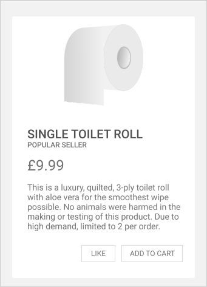
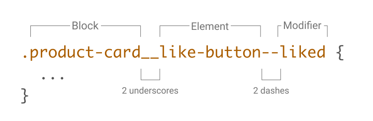
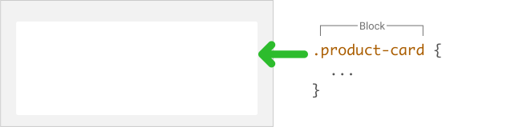
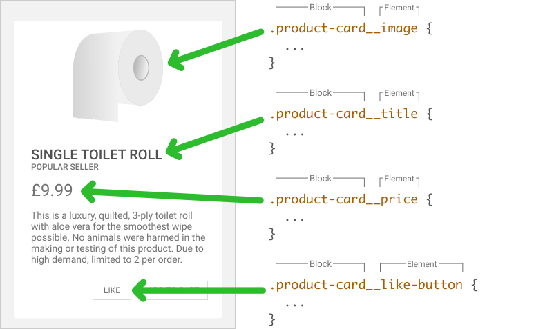
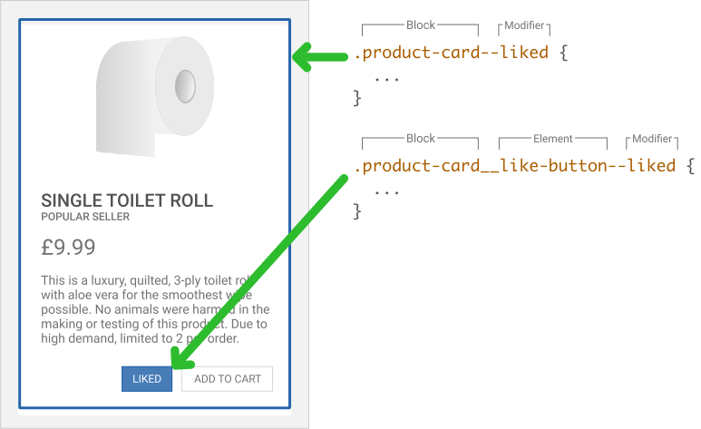
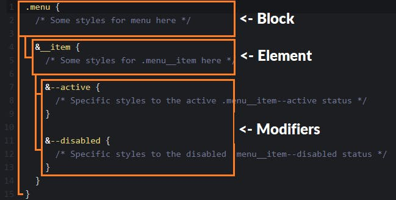
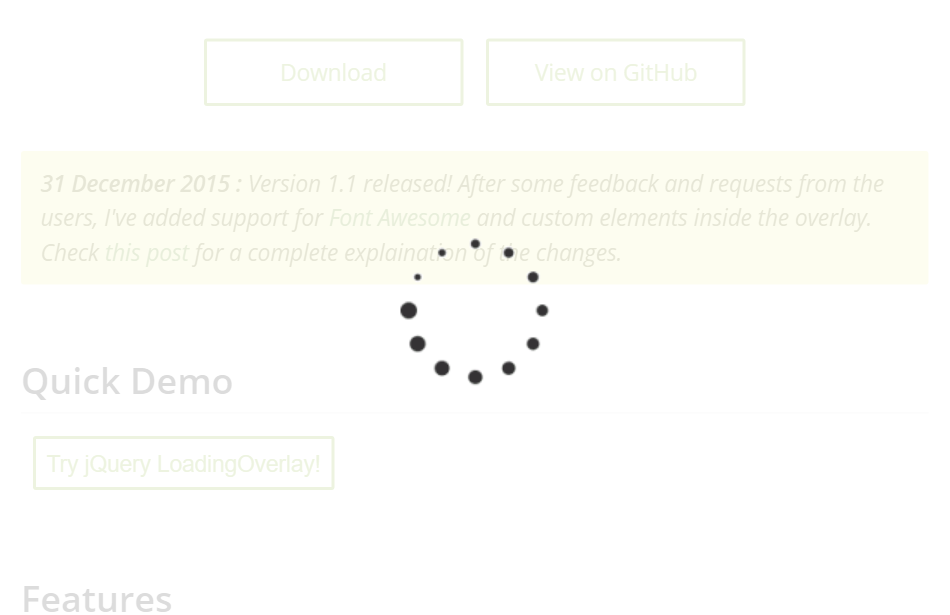
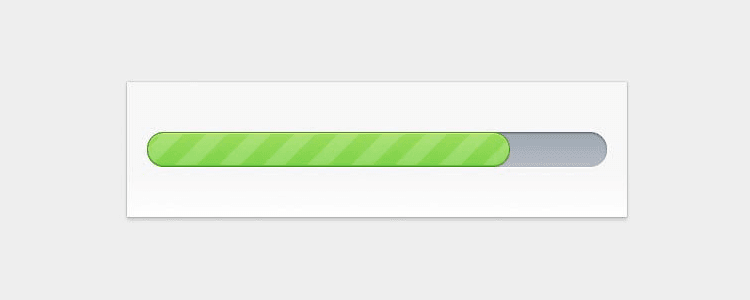
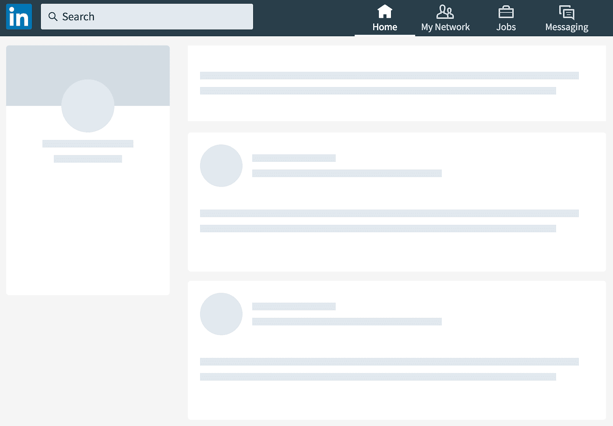

<!-- Protip: Formatea esto con prettier -->

# Investigacion sobre CSS

- [Investigacion sobre CSS](#investigacion-sobre-css)
  - [Temas a tratar](#temas-a-tratar)
  - [CSS | Buenas practicas y estructura de los archivos](#css--buenas-practicas-y-estructura-de-los-archivos)
    - [Tu proyecto tiene una guia de estilo preexistente?](#tu-proyecto-tiene-una-guia-de-estilo-preexistente)
    - [Mantené una consistencia](#mantené-una-consistencia)
    - [Formatea tu CSS para que sea legible](#formatea-tu-css-para-que-sea-legible)
    - [Comentá tu CSS!](#comentá-tu-css)
    - [Crea secciones lógicas en tu stylesheet](#crea-secciones-lógicas-en-tu-stylesheet)
    - [Evitá los selectores demasiado específicos](#evitá-los-selectores-demasiado-específicos)
    - [Dividí stylesheets largos en otros mucho más pequeños](#dividí-stylesheets-largos-en-otros-mucho-más-pequeños)
    - [Usá variables](#usá-variables)
    - [Páginas externas de referencia](#páginas-externas-de-referencia)
  - [CSS | BEM Naming Convention](#css--bem-naming-convention)
    - [Entendiendo BEM con un ejemplo práctico](#entendiendo-bem-con-un-ejemplo-práctico)
      - [Bloque (Block)](#bloque-block)
      - [Elemento (Element)](#elemento-element)
        - [Errores comunes en los elementos:](#errores-comunes-en-los-elementos)
          - [Element chaining (múltiples elementos en una clase)](#element-chaining-múltiples-elementos-en-una-clase)
          - [Nombres basados en el estilo](#nombres-basados-en-el-estilo)
        - [Bloque vs Elemento](#bloque-vs-elemento)
      - [Modificador (Modifier)](#modificador-modifier)
    - [Por qué usar BEM?](#por-qué-usar-bem)
    - [Páginas externas de referencia](#páginas-externas-de-referencia-1)
  - [CSS | Object Oriented CSS (OOCSS)](#css--object-oriented-css-oocss)
  - [Preloaders](#preloaders)
    - [Preloaders más comunes](#preloaders-más-comunes)
    - [Criterios a la hora de usar un preloader](#criterios-a-la-hora-de-usar-un-preloader)

## Temas a tratar

- Estructura del archivos CSS y buenas prácticas
- Opciones de pre loader de imágenes y archivos.
- Criterios de para aplicar un pre loader y herramientas de evaluación

---

## CSS | Buenas practicas y estructura de los archivos

### Tu proyecto tiene una guia de estilo preexistente?

Si estás trabajando en equipo en un proyecto existente, lo primero que hay que verificar es si el proyecto cuenta con una guía de estilo existente para CSS.
**La guía de estilo del equipo siempre debe prevalecer sobre tus preferencias personales.**
No siempre hay una forma correcta o incorrecta de hacer las cosas, pero la consistencia es importante

Si tenes que crear una nueva guia de estilo para tu equipo, recomendaría ver [las guidelines de ejemplos de CSS de MDN Web Docs][CSS-code-examples-guidelines]

### Mantené una consistencia

Si tenés la oportunidad de establecer las reglas para el proyecto o estás trabajando solo, lo más importante es mantener la consistencia.

La consistencia se puede aplicar de muchas formas, como utilizar las mismas [convenciones de nombramiento][css-naming-conventions], llamadas normalmente **Naming Conventions**.
Estas establecen, por ejemplo:

- la forma de nombrar clases
- si se van a utilizar espacios o tabs para identar
- el tamaño de la identación.

Tener un conjunto de reglas a seguir reduce la carga mental al escribir CSS, ya que algunas decisiones ya están tomadas.

### Formatea tu CSS para que sea legible

Hay un par de formas en las que normalmente CSS es.
Algunos desarrolladores ponen todo el CSS una sola línea, así:

```
.box { background-color: #567895; }
h2 { background-color: black; color: white; }
```

Otros desarrolladores prefieren dividir todo en una nueva linea

```css
.box {
  background-color: #567895;
}

h2 {
  background-color: black;
  color: white;
}
```

A CSS no le importa la que uses, pero lo más legible es la segunda opcion

### Comentá tu CSS!

Agregar comentarios a tu CSS no solo va a ayudar a cualquier futuro desarrollador a trabajar con tu CSS, sino que también te va a ayudar a VOS, cuando regreses al proyecto después de un descanso (o incluso al día siguiente).

```
/* Esto es un comentario en CSS
Puede ser dividido en múltiples lineas */
```

Un buen consejo es agregar un bloque de comentarios entre las divisiones de tu CSS, para ayudar a ubicar diferentes secciones rápidamente al leer el archivo, o incluso para darte algo que buscar para ir directamente a esa parte del CSS.

Si usas un string que no va a aparecer en el código, podes saltar de una sección a otra buscando ese string en específico.
Por ejemplo, usando `||`

```css
/* || Estilos Generales */

/* … */

/* || Tipografía */

/* … */

/* || Header */

/* … */
```

No es necesario comentar cada cosa en el CSS, ya que gran parte es autoexplicatorio.
**Lo que debes comentar son las cosas en las que tomaste una decisión particular por una razón en específico.**

Es posible que hayas utilizado una propiedad CSS de una manera específica para solucionar incompatibilidades de navegadores antiguos (Internet Explorer cof cof), por ejemplo:

```css
.box {
  background-color: red; /* fallback para navegadores antiguos que no soportan el uso de gradientes */
  background-image: linear-gradient(to right, #ff0000, #aa0000);
}
```

Quizas seguiste un tutorial para lograr algo, y el CSS no es autoexplicatorio.
En ese caso, es muy recomendable **agregar la URL del tutorial a los comentarios.**
Te lo vas a agradecer, cuando regreses a ese proyecto después de un tiempo y evites la típica situación de recordar vagamente que había un gran tutorial sobre esa cosa específica, pero te acuerdes de dónde era.

### Crea secciones lógicas en tu stylesheet

Es una buena idea tener todo el estilo común al principio del archivo CSS.
Esto significa todos los estilos que generalmente se aplicarán a menos que haga algo especial con ese elemento.
Por lo general, vas a tener reglas configuradas para:

- `body`
- `p`
- `h1`, `h2`, `h3`, `h4`, `h5`
- `ul` y `ol`
- Las propiedades de `table`
- Links

En esta sección del stylesheet, podemos darle un estilo por default a los elementos más comunes, por ejemplo:

```css
/* || ESTILOS GENERALES */

body {
  /* … */
}

h1,
h2,
h3,
h4 {
  /* … */
}

ul {
  /* … */
}

blockquote {
  /* … */
}
```

Después de esta sección, se pueden definir algunas clases de utilidad. Por ejemplo, una clase que elimine el estilo de lista predeterminado para las listas que vamos a mostrar con flex o de alguna otra manera.
Si tenés algunas opciones de estilo que sabés que querés aplicar a muchos elementos diferentes, podés colocarlas en esta sección.

```css
/* || UTILIDADES */

.nobullets {
  list-style: none;
  margin: 0;
  padding: 0;
}

/* … */
```

Luego podemos agregar todo lo que se usa en todo el sitio. Eso podría ser cosas como el diseño básico de la página, el header, el estilo del navbar, etc.

```css
/* || SITEWIDE */

.main-nav {
  /* … */
}

.logo {
  /* … */
}
```

Finalmente, podemos incluir CSS para cosas específicas, desglosadas por el contexto, la página o incluso el componente en el que se utilizan.

```css
/* || STORE PAGES */

.product-listing {
  /* … */
}

.product-box {
  /* … */
}
```

Al ordenar las cosas de esta manera, al menos tenemos una idea en qué parte del stylsheet buscaremos algo que queramos cambiar.

### Evitá los selectores demasiado específicos

Si creas selectores demasiado específicos, a menudo te va a pasar que necesitas duplicar código CSS para aplicar las mismas reglas a otro elemento.
Por ejemplo, podría tener algo como el siguiente selector, que aplica la regla a un `<p>` con una clase `box` dentro de un `<article>` con una clase de `main`.

```css
article.main p.box {
  border: 1px solid #ccc;
}
```

Si despues quisieras aplicar las mismas reglas a algo fuera de `main`, o a algo que no sea `<p>`, tendrías que agregar otro selector a estas reglas o crear un conjunto de reglas completamente nuevo.
En su lugar, podrías usar el selector `.box` para aplicar su regla a cualquier elemento que tenga clase `box`:

```css
.box {
  border: 1px solid #ccc;
}
```

Hay veces en las que hacer algo más específico si tiene sentido; sin embargo, esto generalmente será una excepción en lugar de algo normal.

### Dividí stylesheets largos en otros mucho más pequeños

En los casos en los que tenga estilos muy diferentes para distintas partes del sitio, es posible que quieras tener una stylesheet que incluya todas las reglas globales, así como algunas hojas de estilo más pequeñas que incluyan las reglas específicas necesarias para esas secciones.
Podes vincular a varias hojas de estilo desde una página y se aplican las reglas normales de la cascada, con las reglas de las hojas de estilo vinculadas más tarde después de las reglas de las hojas de estilo vinculadas anteriormente.

Por ejemplo, podrías tener una tienda en línea como parte del sitio, con una gran cantidad de CSS utilizado solo para diseñar las listas de productos y los formularios necesarios para la tienda.
Tendría sentido tener esas cosas en una stylesheet diferente, solo vinculadas a las páginas de la tienda.

Esto hace que sea más fácil mantener el CSS organizado. También significa que si varias personas están trabajando en el mismo CSS, vas a tener menos situaciones de conflictos en el control de código fuente.

Para cada hoja de estilo que vincules a una página, solo necesitarías agregar un elemento adicional <link>. Así:

```html
<link href="style1.css" rel="stylesheet" />
<link href="style2.css" rel="stylesheet" />
...
```

Sin embargo, al aplicar más de una hoja de estilo a tu página, hay algunas cosas que debes tener en cuenta.
Cuando vinculas varios archivos CSS, los estilos se aplican en el orden en que están vinculados en el documento HTML.
Entonces, en el código anterior, todas las reglas de style1.css se aplicarían primero, luego se aplicarían las reglas de style2.css.
Esto puede hacer que reglas similares sobrescriban las reglas de los archivos vinculados previamente.

Además, vincular demasiados archivos, en general, puede afectar el rendimiento de una página web, ya que cada archivo debe cargarse en el navegador.
Más archivos significarán que más de ellos deben transferirse y cargarse desde el servidor, lo que puede ralentizar el tiempo de carga.
Esto se soluciona usando un preprocesador como SASS y un minifier como cssnano

### Usá variables

Las variables en CSS te permiten almacenar y reutilizar valores, lo que hace que tus hojas de estilo sean más flexibles y fáciles de mantener.

Para usar variables, primero las definís utilizando el prefijo -- seguido de un nombre y el valor asignado.

```css
:root {
  --color-primario: #ff0000;
  --tamano-fuente: 16px;
}
```

Una vez definidas, podes usar las variables haciendo referencia a ellas con la función var().

```css
.header {
  color: var(--color-primario);
  font-size: var(--tamano-fuente);
}
```

Si deseas cambiar el valor de una variable, puedes actualizarla en el selector :root u en cualquier otro selector.

```css
:root {
  --color-primario: #00ff00;
}

.header {
  --tamano-fuente: 20px;
}
```

El uso de variables en CSS te permite actualizar fácilmente los valores en un solo lugar, lo que provoca cambios globales en todas tus hojas de estilo.
Esto ahorra tiempo y esfuerzo, especialmente cuando tienes múltiples elementos o componentes que utilizan los mismos valores repetidamente.

### Páginas externas de referencia

- [Organizing your CSS][organizing-css-mdn] de MDN Web Docs
- [Guidelines for styling CSS code examples][CSS-code-examples-guidelines] de MDN Web Docs

---

## CSS | BEM Naming Convention


Hay una convención en CSS muy conocida llamada BEM (Block Element Modifier), **usada para nombrar clases en CSS de una manera estructurada y descriptiva.**
Generalmente, hay 3 problemas que las naming conventions tratan de solucionar:

1. Saber que hace un selector, solamente mirando el nombre
2. Tener una idea de en donde un selector puede ser usado, solamente mirandolo
3. Tener una idea de las relaciones entre las clases, solamente mirandolas

Alguna vez viste clases con nombres como estos?

```css
.nav__header-dark {
  ...;
}
.nav__button-submit {
  ...;
}
.nav__button-cancel {
  ...;
}
```

Eso es **BEM**. BEM divide cada componente de una página web en 3 partes:

1. Bloque
2. Elemento
3. Modificador

### Entendiendo BEM con un ejemplo práctico

Imagina la siguiente card de una página web:



BEM se basa únicamente en los nombres de las clases CSS para aplicar estilos en el HTML, por lo que no hay tags HTML ni uso de ID.
Los nombres de clase BEM pueden constar de 3 partes: `[bloque]__[elemento]--[modificador]`



#### Bloque (Block)

Un Bloque es un componente de un sitio web que puede existir por si mismo.
En este ejemplo, estamos usando una tarjeta de producto (product-card) como nuestro bloque, pero otros ejemplos de un posible Bloque podrían ser:

- el encabezado (header/navbar)
- pie de página (footer)
- un formulario de inicio de sesión (`login-form`)
- una lista de items (`check-list`).



Los nombres de los bloques están en minúsculas y cada palabra está separada por un solo guión (-), por ejemplo `check-list` y `site-header`

Cuando sea posible, **los Bloques deben ser nombrados de la manera más genérica posible para que puedan reutilizarse**.

En este ejemplo, tenemos una `product-card`, pero si existen otras tarjetas en el sitio web que siguen un estilo y diseño similares, sería mejor tener un Bloque de tarjetas que podría usarse para otras tarjetas, como tarjetas de ofertas y tarjetas de productos más recientes. etc.

#### Elemento (Element)

Un **elemento** es un objeto secundario de un bloque que solo existe dentro de ese bloque.
En nuestro ejemplo de `product-card`, la imagen, el título, el precio y el botón de Like son ejemplos de **Elementos** dentro del bloque `product-card`.



Todos los nombres de los elementos comienzan con el nombre del bloque seguido de 2 guiones bajos (`__`) y el nombre del elemento en minúsculas con palabras separadas por un guión,
por ejemplo `product-card__title` y `site-header__logo-image`.

##### Errores comunes en los elementos:

###### Element chaining (múltiples elementos en una clase)

Una cosa a tener en cuenta con los Elementos es que **no deben estar encadenados.**
<br>
Si tomamos el ejemplo de una lista de compras (`shopping-list`), esta tiene artículos (`item`) y cada artículo tiene una imagen del producto (`product-image`).

A primera vista, se puede pensar que el Bloque es `shopping-list`, el Elemento 1 es `item` y el Elemento 2 es `product-image`,
pero esto es incorrecto ya que **solo debe haber un Elemento en el nombre de la clase.**

```css
/* INCORRECTO */
.shopping-list__item__product-image {
  ...;
}
```

En su lugar, `product-image` debe considerarse como un Elemento dentro del Bloque `shopping-list`, y la clase debe nombrarse como tal.

```css
/* CORRECTO */
.shopping-list__product-image {
  ...;
}
```

###### Nombres basados en el estilo

Los elementos deben nombrarse en función del "tipo de cosa que se muestra" en lugar del "estilo que se aplicará".
Con nuestra tarjeta de producto, tenemos un título con un estilo más grande y en negrita, pero el elemento no debe nombrarse según su estilo.

```css
/* INCORRECTO */
.product-card__large-bold {
  ...;
}
```

El problema con el nombre de esta clase es que, simplemente leyéndolo, es difícil saber dónde se puede llegar a usar y dónde se puede/debe reutilizar en el futuro.
Además, si este estilo se llegara a usar para el título, el precio, la disponibilidad y otra información en la tarjeta del producto,
existe la posibilidad de que un desarrollador cambia esta clase porque quiere una fuente más grande para el título, pero en realidad estaría aumentando el tamaño de fuente para todos los demás elementos, lo cual puede no ser su intención.

```css
/* CORRECTO */
.product-card__title {
  ...;
}
```

##### Bloque vs Elemento

En el ejemplo de tarjeta de producto, el Elemento `like-button` existe dentro del Bloque de `product-card`,
lo que implica que **solo mostramos botones de Like en las tarjetas de producto.** <br>
Si ese no es el caso y los botones de Like se pueden mostrar en otras partes del sitio, el botón Like **debería convertirse en su propio bloque independiente**

#### Modificador (Modifier)

Un modificador se puede aplicar a un bloque o a un elemento, y se usa para ajustar el aspecto o el comportamiento predeterminado del mismo.

Con el ejemplo de la tarjeta de producto, el modificador `liked` existe y se puede aplicar tanto al Bloque `product-card` como al Elemento `like-button` cuando se le haya dado Like a un producto.



Los nombres de los modificadores están separados del Bloque o Elemento por 2 guiones (`--`) y deben estar en minúsculas y las palabras separadas por un guión, por ejemplo `product-card--unavailable` y `shopping-list__item--limited-stock`.

Los modificadores siempre deben usarse junto con el Bloque o Elemento original y simplemente overridear los atributos para que sean diferentes.
También es posible utilizar varios modificadores en el mismo tag HTML.

```html
<button class="btn btn--primary">Download</button>

<button class="btn btn--primary btn--disabled">Download</button>
```

### Por qué usar BEM?

Porque soluciona los dos problemas que tiene hoy en día la modularidad en CSS

1. Evita problemas de herencia usando clases CSS únicas por cada elemento (por ejemplo, `.header__list-item`)
2. Reduce conflictos de estilo al mantener la especificidad de CSS al mínimo

El uso de BEM tambien trae consigo los siguientes beneficios:

- **Nombres consistentes de los selectores CSS —**
  Cuando se está trabajando en un proyecto grande en el que trabajan varios desarrolladores, a menudo hay diferentes niveles de experiencia y diferentes enfoques de CSS. Con BEM, cada desarrollador debería poder comprender rápidamente dónde se usa cada clase CSS y comprender cómo deben nombrar las nuevas clases.

- **Menos estilos rotos inesperados —**
  Dado que las clases en BEM siempre se dirigen a un Bloque, **en teoría**, cualquier cambio de estilo relacionado con ese bloque no afectará a otros bloques.

- **Adios al problema de conflictos en los nombres de las clases —**
  Con un BEM bien escrito, no debería haber conflictos en los nombres de las clases

- **Cualquier etiqueta HTML puede ser usada—**
  Como BEM solo usa clases y no etiquetas o IDs, se puede usar cualquier etiqueta HTML que se considere adecuada.

- **Adaptabilidad frente a cambios en el HTML —**
  Como las clases BEM son discretas e independientes, la estructura de nuestro HTML puede cambiar con el tiempo sin romperse,
  siempre que las clases esten bien setteadas.

- **Promueve el diseño modular basado en componentes —**
  BEM hace que el desarrollador piense que su sitio se compone de áreas discretas independientes, lo que promueve la abstracción y la reutilización

- **Buena integración con preprocesadores —**
  [Por su forma de ser, se integra muy bien con preprocesadores como SASS][bem-with-sass]
  <br>
  Por ejemplo, en SASS un código BEM se ve así

  

### Páginas externas de referencia

Para más información, podés ver:

- [Explicando BEM a un niño de 5 años][bem-for-5yo]
- [Ejemplos de como usar BEM correctamente y buenas practicas][bem-examples]
- [Bem explicado visualmente y errores comunes][bem-visually-explained]
- [Bem con SASS][bem-with-sass]

---

## CSS | Object Oriented CSS (OOCSS)

OOCSS es un enfoque para escribir CSS que promueve la reutilización y modularidad del código. En lugar de aplicar estilos directamente a elementos específicos, separamos la estructura y la apariencia, y creamos clases reutilizables que pueden aplicarse a múltiples elementos.

Ejemplo:

En lugar de esto:

```css
button {
  background-color: #ff0000;
  color: #ffffff;
  border-radius: 4px;
}

h1 {
  font-size: 24px;
  font-weight: bold;
  color: #333333;
}
```

Podemos hacer esto:

```css
.button {
  /* Estilos comunes para un botón */
}

.heading {
  /* Estilos comunes para un encabezado */
}
```

Y luego aplicar esas clases a los elementos HTML:

```html
<button class="button">¡Haz clic aquí!</button>

<h1 class="heading">Título grande</h1>
```

Al utilizar clases reutilizables, podemos mantener un código más limpio y reducir la duplicación de estilos. Además, podemos combinar varias clases para crear elementos más complejos y personalizados.

<!-- Links -->

[organizing-css-mdn]: https://developer.mozilla.org/en-US/docs/Learn/CSS/Building_blocks/Organizing
[CSS-code-examples-guidelines]: https://developer.mozilla.org/en-US/docs/MDN/Writing_guidelines/Writing_style_guide/Code_style_guide/CSS
[prettier]: https://prettier.io/
[css-naming-conventions]: https://www.freecodecamp.org/news/css-naming-conventions-that-will-save-you-hours-of-debugging-35cea737d849/
[bem-with-sass]: https://andrew-barnes.medium.com/bem-and-sass-a-perfect-match-5e48d9bc3894
[bem-examples]: https://sparkbox.com/foundry/bem_by_example
[bem-visually-explained]: https://keepinguptodate.com/pages/2020/05/bem-visually-explained/
[bem-for-5yo]: https://www.freecodecamp.org/news/css-naming-conventions-that-will-save-you-hours-of-debugging-35cea737d849/#the-bem-naming-convention

---

## Preloaders

Un preloader, también conocido como cargador o pantalla de carga, es un elemento visual que se muestra en una página web o una aplicación móvil mientras se cargan los contenidos o se realiza alguna tarea en segundo plano.
Su propósito principal es proporcionar retroalimentación visual al usuario, indicando que la página o la aplicación está procesando algo y que se espera una carga completa

El uso de un preloader es beneficioso porque brinda una mejor experiencia al usuario, ya que evita que la pantalla se muestre en blanco o sin respuesta mientras los contenidos se están cargando.
Además, transmite la sensación de actividad y progreso, lo que ayuda a mantener al usuario informado y disminuye la percepción de tiempo de espera

**En resumen, un preloader es un elemento visual utilizado para indicar que una página web o una aplicación está cargando**

### Preloaders más comunes

- **Lazy Loading:** La técnica de "carga perezosa" consiste en cargar las imágenes y los archivos a medida que el usuario se desplaza por la página. Esto ayuda a mejorar el rendimiento al cargar solo los elementos visibles en pantalla, y puedes mostrar un preloader hasta que la imagen o el archivo se cargue por completo.

- **Spinners:** Los spinners son elementos visuales animados que indican que se está cargando contenido. Puedes utilizar bibliotecas como SpinKit, que ofrecen una variedad de spinners predefinidos que puedes integrar fácilmente en tu página web.

  

- **Overlay con mensaje de carga:** Puedes mostrar un overlay semi-transparente sobre la imagen o el área donde se cargará el archivo, junto con un mensaje que indique que la carga está en progreso. Esto proporciona una indicación visual clara de que se está realizando una carga.

  

- **Barra de progreso:** Una barra de progreso es una representación visual lineal que muestra el progreso de la carga. Puedes utilizar CSS o bibliotecas como ProgressBar.js para crear una barra de progreso animada que se actualice a medida que los archivos se cargan.

  

- **Placeholder o imagen de carga:** Puedes utilizar una imagen de carga o un placeholder de baja resolución mientras la imagen o el archivo se carga por completo. Esto ayuda a mantener la estructura de la página y proporciona una indicación visual de que se espera la carga.

  

### Criterios a la hora de usar un preloader

- **Tiempo de carga:** Evalúa si tu página web o aplicación tiene elementos que requieren un tiempo de carga significativo, como imágenes de alta resolución, archivos pesados o contenido dinámico. Si hay componentes que tardan en cargarse, es recomendable implementar un preloader para brindar retroalimentación visual al usuario mientras espera.

- **Experiencia del usuario:** Piensa en cómo impacta el tiempo de carga en la experiencia del usuario. Si la carga de la página es lenta y no hay indicadores visuales de progreso, los usuarios podrían percibir que la página está "atascada" o que algo no funciona correctamente. Un preloader puede mantenerlos informados y reducir la frustración.

- **Importancia del contenido inicial:** Determina si hay contenido crítico que debe mostrarse de inmediato al cargar la página. Si es así, es recomendable priorizar la carga de ese contenido y utilizar un preloader para los elementos secundarios.
